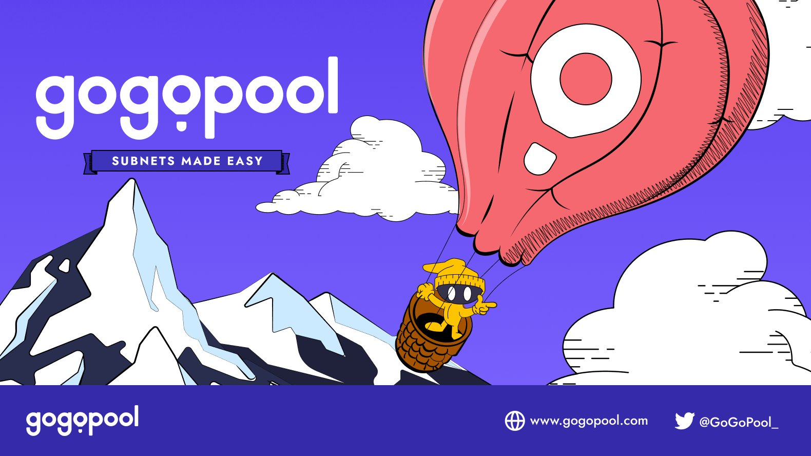

# 🖖 Welcome

<figure><figcaption></figcaption></figure>

## What is GoGoPool?

GoGoPool is the first permissionless staking protocol built for [Avalanche Subnets](https://docs.avax.network/subnets), allowing node operators to launch validators cheaper and faster using the GGP token. Currently, we cater to node operators and liquid stakers.

### With GoGoPool, a node operator can:

* Launch their node for 1000 AVAX + 100 AVAX in GGP tokens, nearly half the price of the traditional avenue!
* Earn rewards on both their staked AVAX as well as the staked GGP, and receive an operating fee for running a node.
* Start validating with just a few clicks, helping to secure the Avalanche network and promoting innovation.&#x20;

Start your minipool today: [app.gogopool.com/create-minipool](https://app.gogopool.com/create-minipool)

### For liquid stakers, we offer:

* Affordable staking for as little as .01 AVAX.
* A token, ggAVAX, to provide instant liquidity that accrues value overtime.
* Be a part of directly growing the Avalanche network and getting more subnets and validators launched.

Stake with GoGoPool today: [app.gogopool.com/liquid-staking](https://app.gogopool.com/liquid-staking)
