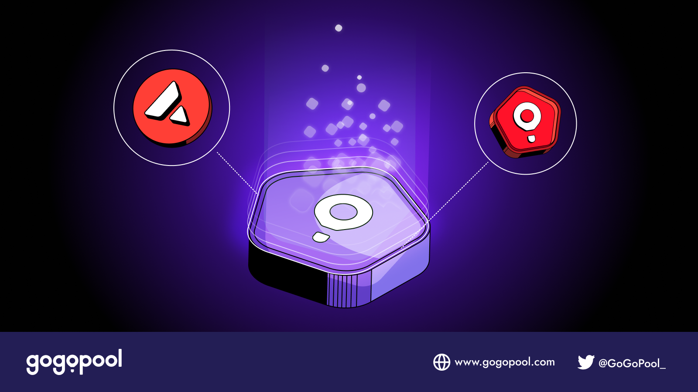

# How Liquid Staking Works

<figure><figcaption></figcaption></figure>

## Overview

When a user liquid stakes with GoGoPool, their $AVAX goes directly towards growing the Avalanche network and getting more subnets and validators launched.\
\
Their AVAX is staked into a deposit pool. These deposit pool funds are used to match with node operators who want to become a validator for Avalanche's primary network. To learn more about how Avalanche utilizes proof-of-stake validation, check out [Avalanche's official documentation](https://www.avax.network/proof-of-stake-pos).\
\
Every Subnet requires validators to operate, and every Subnet validator must also validate the Avalanche Primary network. Currently, there is no cohesive way for Subnets in need of validators and validators who want to validate Subnets to get in contact. GoGoPool aims to solve this by incentivizing node operators to run through the protocol, in order to create a set of validators that are oriented towards helping Subnets. Our community of Liquid Stakers is essential for this mission to succeed.

## What is ggAVAX and what can users do with it?

[ggAVAX is an ERC4626](../../gogopooldesign/ggpavax-via-erc-4626.md). When users stake AVAX, ggAVAX is minted and given to them in exchange.&#x20;

This token is considered liquid and can be used like AVAX whereby users can hold it to accrue staking rewards, sell it, or use it to earn additional yield.&#x20;

## What happens to the user's staked AVAX?

When a user deposits AVAX as a liquid staker on GoGoPool, their AVAX gets staked to the TokenggAVAX contract, this is also known as the deposit pool. Each time a new Minipool is launched, 1000 AVAX is withdrawn from this contract ([code reference](https://github.com/multisig-labs/gogopool/blob/main/contracts/contract/tokens/TokenggAVAX.sol#L170)). Together with the Minipool owner's staked 1000 AVAX, Avalanche's minimum 2000 AVAX requirement is met for the Minipool to become a validator. GoGoPool's advanced multisig technology transfers those funds from the C-chain to the P-chain and registers the minipool as a validator with Avalanche.

Every 15 days a Minipool finishes its validation period. At this time, the Minipool funds and the rewards it earned from validating are transferred back to the C-chain. Because the 1000 AVAX  from the deposit pool did work by validating, it gets part of the rewards the Minipool earned from Avalanche. Those rewards and the original 1000 AVAX are put back into the deposit pool. Over time as the deposit pool grows due to the rewards it has earned and ggAVAX accrues value.

## What happens when ggAVAX is redeemed for AVAX?

When funds are available in the pool, ggAVAX holders can swap their ggAVAX for AVAX. However, if all funds in the pool are validating on-chain in a Minipool, users must wait until a Minipool has completed before swapping. Once a user successfully redeems their ggAVAX for AVAX, the ggAVAX is burned.

