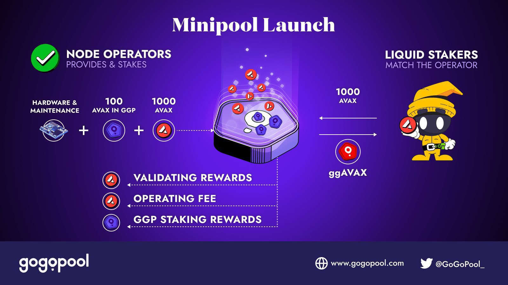

# How Minipools Work

<figure><figcaption></figcaption></figure>

A GoGoPool minipool represents a validator that was funded via AVAX contributed from liquid stakers using the deposit pool and AVAX contributed from node operators during their registration with GoGoPool.

## How are minipools created?

A node operator brings their NodeId to GoGoPool and registers with it. This indicates that they have their own hardware set up and are ready to become an Avalanche validator. For detailed instructions on setting up a node, refer to [Avalanche's official documentation](https://docs.avax.network/nodes).

To become a validator with Avalanche, a node needs 2000 AVAX. Through GoGoPool, the node operator contributes half of this amount, while the remaining half is sourced from the liquid staking deposit pool. To secure the half obtained from the deposit pool, the node operator pledges at least 100 AVAX worth of collateral in the form of GGP tokens. This collateral serves as a commitment to good behavior and allows the protocol to recover losses in case of misconduct.

After registering their NodeId, staking 1000 AVAX, and collateralizing with GGP tokens, the node operator's[ minipool is created](https://github.com/multisig-labs/gogopool/blob/main/contracts/contract/MinipoolManager.sol#L192).

The minipool is then [matched with liquid staking funds](https://github.com/multisig-labs/gogopool/blob/main/contracts/contract/MinipoolManager.sol#L324) from the deposit pool. The OracleDAO transfers these funds from the C-chain to the P-chain for staking purposes and registers the minipool as a validator in the Avalanche network.

To ensure consistent returns for liquid stakers and compound returns for node operators, the protocol implements minipool cycling.

## What is minipool cycling?

Minipools validate in 15-day cycles. At the end of each cycle, the OracleDAO transfers the original 2000 AVAX and earned rewards back to the C-chain. The liquid staking funds and their corresponding rewards are returned to the deposit pool for accurate growth tracking. If the protocol determines that the minipool should [undergo another cycle](https://github.com/multisig-labs/gogopool/blob/main/contracts/contract/MinipoolManager.sol#L459), the funds are once again withdrawn. These funds are [paired](https://github.com/multisig-labs/gogopool/blob/main/contracts/contract/MinipoolManager.sol#L488) with the mirrored amount from the node operator's original funds and rewards. As a result, **more than** 2000 AVAX is staked for the upcoming 15-day validation period, leading to compounded rewards for both parties involved.

