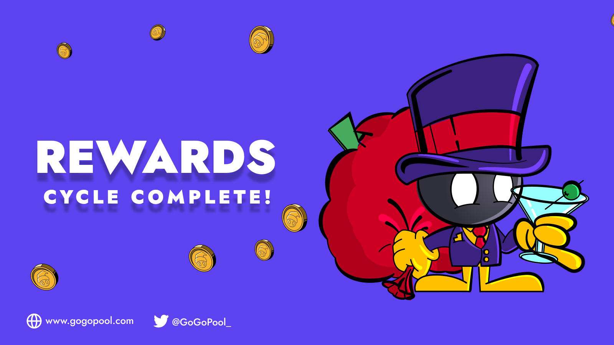

# GGP Rewards

<figure><figcaption></figcaption></figure>

## Overview

GGP is GoGoPool's protocol token. Its utility is collateral for the 1k AVAX that node operators borrow from the protocol to launch their validator. For providing this collateral, the protocol rewards the node operator with GGP rewards generated by the inflation built into the protocol. The more GGP staked as insurance, up to a maximum of 150% of the staked AVAX's value, the more GGP rewards the node operator receives.

## How does monthly inflation work?

GGP has a fixed supply of 22.5 million. On genesis 18 million GGP were minted. Learn more about the distribution of that supply [here](../../readme-1/tokens-and-utility.md#supply-breakdown-and-vesting). This means that there are still 4.5 million tokens left to be minted. These tokens will be released to the ecosystem in the form of a monthly rewards cycle. To start, this inflation will be 5% annually.

## What are the requirements to be eligible?

* Any one of a user's minipools has to have started validating for at least 15 days before the end of the rewards cycle.
* A user must have GGP staked at the time of the rewards calculation.

## How much is distributed each month?

It changes over time, this [spreadsheet](https://docs.google.com/spreadsheets/d/1Gjdp1rP2MrsGO9QQuia\_rjyo\_8nQm-5jNDt2vIUZMhI/edit#gid=0) can be used to get a rough estimate. Feel free to make a copy for your own use.

## How is the monthly inflation distributed?

To start, the distribution of the monthly inflation is as follows:

* 70% to Node Operators
* 10% to Oracle DAO&#x20;
* 20% to Protocol DAO Treasury

## How are individual Node Operator's rewards calculated?

Generally speaking, it is a node operator's effective GGP stake over the total effective GGP stake of all the eligible node operators for that cycle. Where effective GGP stake is staked GGP up to the 150% collateralization ratio.

That being said, GoGoPool does have some seed investors that are running minipools, to bootstrap the protocol. Those individuals will be weighted at a lower amount than a typical node operator. This weight will grow over time, as the investor's GGP vests.\
\
GGP rewards calculator coming soon.
