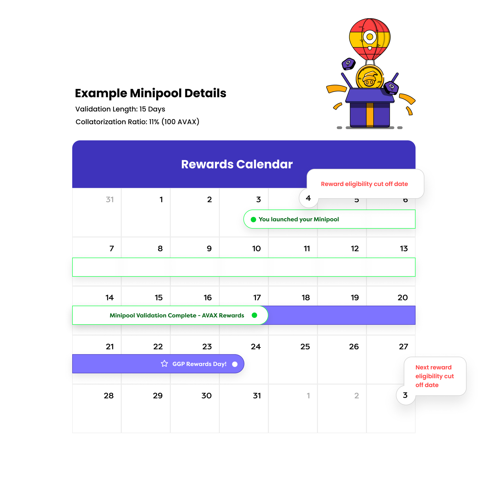

# ⚙️ How Minipool Works

Minipools simplify the validator operation process and reduce financial barriers on the Avalanche network, offering an efficient pathway for users to engage in network consensus activities by becoming a validator.

### Minipool Operation Workflow

1. **Minipool Operator Registration**: Potential minipool operators have two options for joining GoGoPool as validators.
   * **One-click Minipool Creation**: They can use the One-Click Launcher, which automatically sets up the node, simplifying the process for those without technical expertise.
   * **Manual Setup**: They can manually register their Node ID if they have their own hardware setup.
2. **Funding and Collateralization**: To meet Avalanche's 2000 `AVAX` requirement for validators, each minipool operator contributes 1000 AVAX, with the remaining amount matched from GoGoPool's liquid staking deposit pool. Minipool operators also secure this partnership by staking a minimum of 100 `AVAX` worth of `GGP` tokens as collateral, which ensures their commitment to maintaining network integrity and results in additional `GGP` rewards.
3. **Activation of Minipool**: After the node setup is completed and the minipool is created, the combined 2000 `AVAX` is transferred from the C-chain (Contract Chain) to the P-chain (Platform Chain) by utilizing advanced multisig technology. The Minipool is then officially registered as a validator on the Avalanche network.
4. **Validation and Validating Reward's Distribution**: Each Minipool participates in the Avalanche network's validation process for 15-day cycles, earning rewards from validating the network based on their validation uptime.
5. **Minipool Cycling for Compounded Rewards**: At each minipool cycle's end, the OracleDAO transfers the staked `AVAX` and accumulated rewards back to the C-chain for distribution. If the Minipool continues into another cycle, the previously earned rewards are reinvested, enhancing the staking amount and leading to compounded returns.
6. **Completion of Minipool**: Once the full duration of the minipool has been fulfilled, the minipool operator will be able to withdraw their funds and rewards.

### GGP Rewards Eligibility and Distribution

GoGoPool offers `GGP` rewards to minipool operators who meet specific eligibility criteria within defined reward cycles.

Upon successful operation of a Minipool, minipool operators are rewarded with `GGP` tokens, which are GoGoPool's protocol tokens used primarily as collateral. The amount of `GGP` rewards received is proportional to the `GGP` staked as collateral, up to 150% of the staked `AVAX` value. These rewards are part of the protocol's inflation strategy, which allocates 70% of the monthly inflation to minipool operators, enhancing their earnings as an incentive.

Here’s how you can qualify and what you need to know about the timing of these cycles.

#### Key Dates and Cycles

* **Reward Cycle**: A reward cycle within GoGoPool lasts for 30 days.
* **Eligibility Date**: To qualify for rewards in a specific cycle, your Minipool must be created at least 15 days before the cycle ends.
* **Reward Distribution Date**: Rewards are distributed on the last day of each cycle, provided your Minipool was launched before the end of the cycle.


🎈 Check our [Analytics](https://flipsidecrypto.xyz/GoGoPool/ggp-protocol-stats-PitGzK?tabIndex=2) page for the current eligibility date and reward distribution date.


#### Eligibility Requirements

* **Minipool Validation Period**: Your Minipool must be created before the eligibility date, which is at least 15 days prior to the end of a reward cycle, to be eligible for rewards during that cycle. It does not matter if it is in the queue at the time of the eligibility date, but validation must start before the reward distribution date.
* **Staking GGP**: You must have `GGP` tokens staked (at least 10% of the staked `AVAX` value) as collateral at the reward distribution time to qualify. Even if your minipool is ended before the reward distribution date, your `GGP` must be staked at that time.

<figure><figcaption>
Sample Minipool Reward Eligibility Calendar 
</figcaption></figure>
