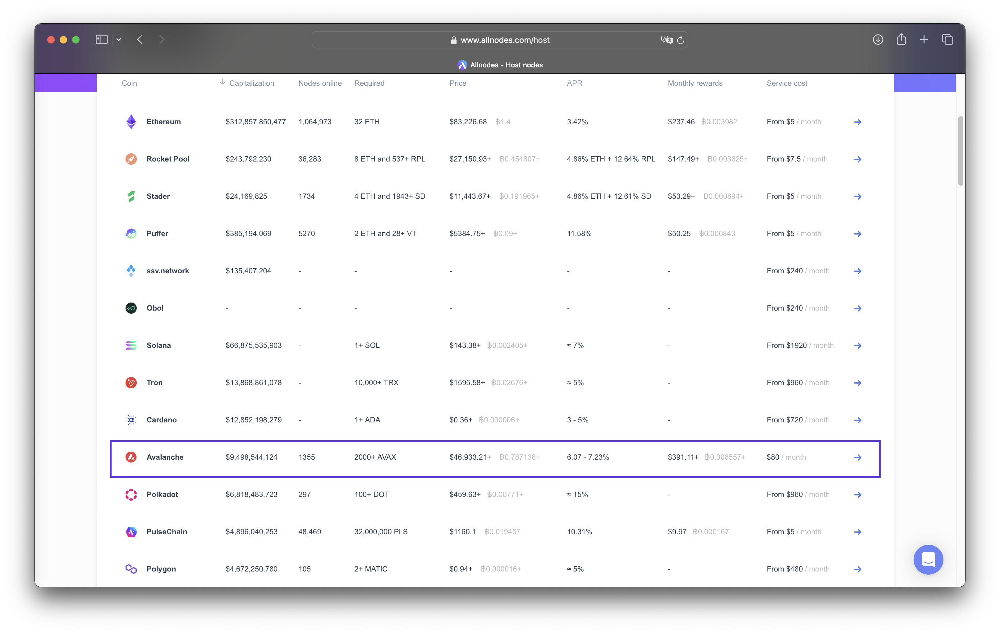
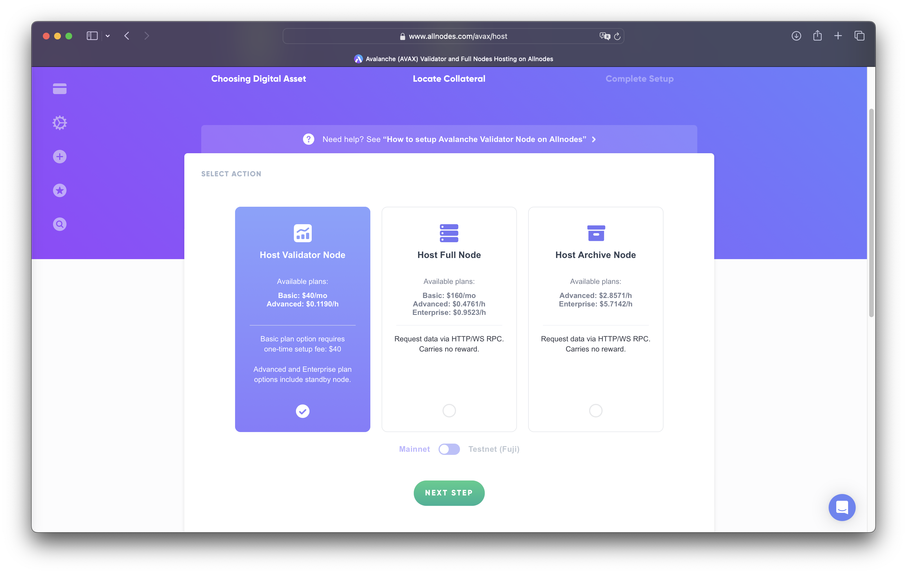
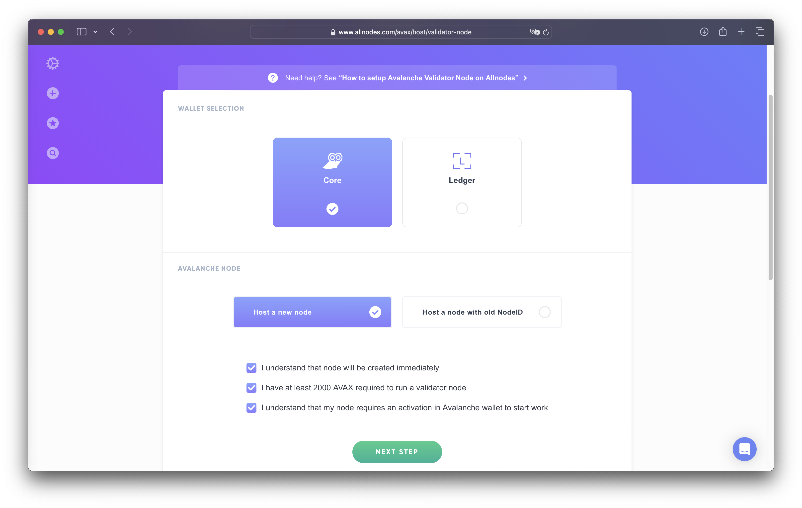
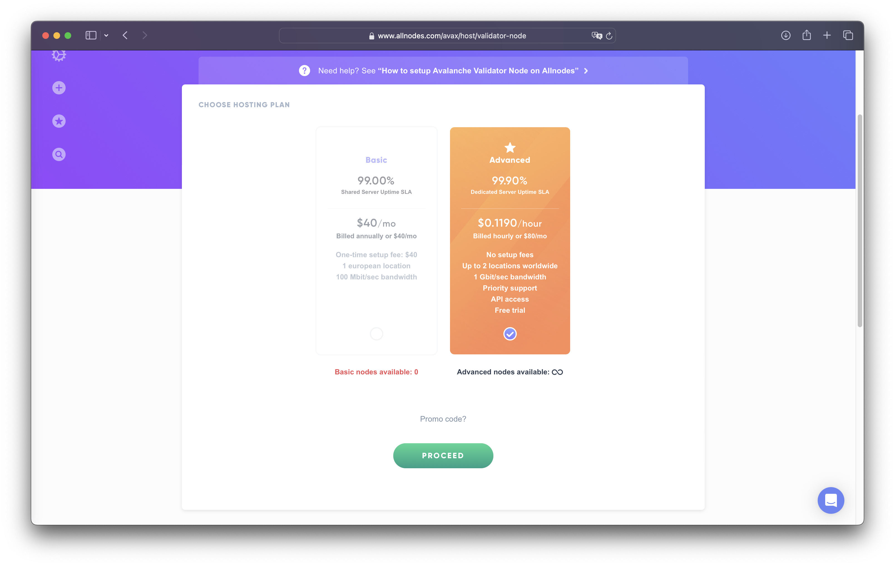
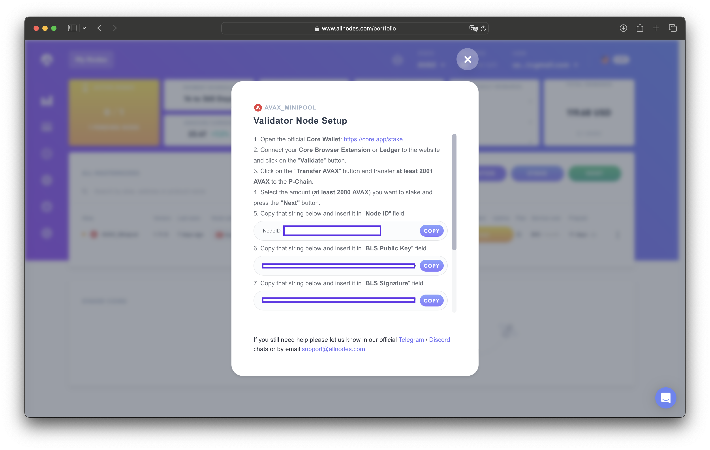
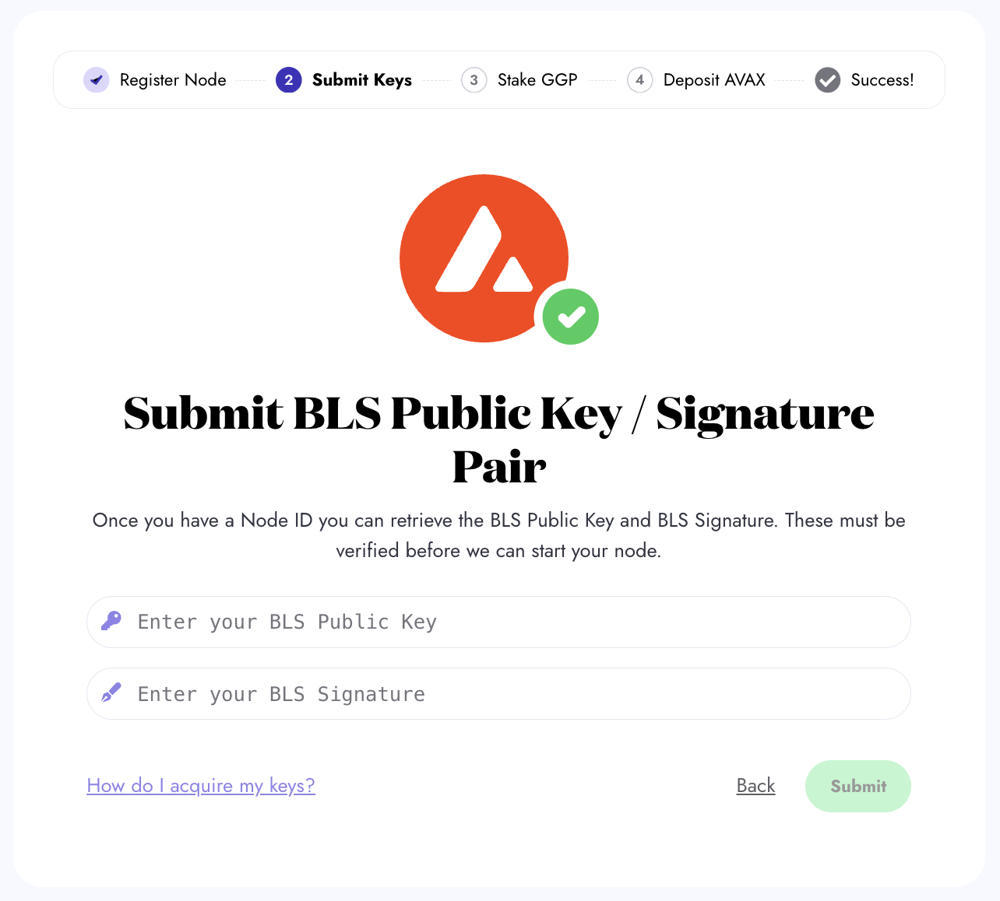

# 🖥️ Guide: How to Launch a Minipool using Allnodes

This guide is designed for users who want to set up a Minipool on GoGoPool using [Allnodes](https://www.allnodes.com/), a popular platform for hosting Avalanche nodes. By following these steps, you'll be able to launch your node on [Allnodes](https://www.allnodes.com/), retrieve the necessary Node ID and BLS keys, and then create a Minipool on GoGoPool.


The visuals for each setup below show how to create a Minipool on Fuji Testnet. The steps are the same as on Mainnet, but the `AVAX` and `GGP` requirements are different.

Use our [faucet](https://faucet.gogopool.com) to get a test GGP and test GoGoPool on Fuji Testnet.


## Setting Up Your Node on Allnodes

To use GoGoPool as a Minipool operator, and earn rewards on your staked `GGP`, you have to have an Avalanche node. In this section, you will learn how to launch your node on Allnodes.

### Step 1: Choose Host Node as Avalanche

* Visit the [Allnodes](https://www.allnodes.com/) website and sign in or create an account.
* Navigate to the **Host Nodes** section and select **Avalanche** from the list of supported networks.

<figure><figcaption>
Select <strong>Avalanche</strong> from the list of supported networks
</figcaption></figure>

### Step 2: Select Node Type

* Choose the **Validator Node** option as your node type.
* Click **Next Step** to proceed.

<figure><figcaption>
Select <strong>Validator Node</strong> as your node type
</figcaption></figure>

### Step 3: Choose Wallet Type and Host a New Node

* Select your preferred wallet type.
* Choose **Host a new node**.
* Agree to all the checkmarks for terms and conditions.
* Click **Next step** to continue.


**Important Note:** The Allnodes instructions are designed for native Avalanche validators, which require 2000 AVAX in your wallet. However, when using GoGoPool, you only need 1000 AVAX to run a Minipool. You can safely ignore any instructions from Allnodes that mention needing 2000 AVAX in your wallet, as GoGoPool's protocol allows you to operate a Minipool with half the AVAX typically required.


<figure><figcaption>
Select <strong>Host a new node</strong> and proceed
</figcaption></figure>

### Step 4: Select Hosting Plan

* Choose your preferred hosting plan based on your budget and requirements.
* Complete the payment process to launch your node.


The **basic plan** may not be available at all times.


<figure><figcaption>
Choose your hosting plan and proceed
</figcaption></figure>

### Step 5: Retrieve Node ID and BLS Keys

1. After your node is launched, you'll see a **User Action Required** modal. This will contain your **Node ID**, **BLS Public Key**, and **BLS Signature**.
2. Copy these details as you'll need them for the next steps on GoGoPool.


You can also reach these details by clicking the arrow next to your Node ID under the **Node address** ta&#x62;**.**


<figure><figcaption>
Keep handy your Node ID, BLS Public Key, and BLS Signature
</figcaption></figure>

## Launching a Minipool on GoGoPool

As your node is ready, we can move forward with launching a Minipool.

### Step 6: Register Your Node ID with GoGoPool

* Go to the [GoGoPool](https://app.gogopool.com/) platform and connect your wallet.
* Navigate to the **Create a Minipool** section and select **Manual Setup**.
* Enter your Node ID and select the duration of your Minipool.
* Click **Next** to continue.


A longer duration is advisable since it allows your `AVAX` to compound over successive 15-day cycles, ensuring that your Minipool continues running seamlessly without the need to re-queue for each new cycle.


<figure><figcaption>
Place your Node ID in the input box as shown, then press Next.
</figcaption></figure>

### Step 7: Submit BLS Public Key

Enter your BLS public key and signature for verification. Further information about BLS keys is [here](avalanche-bls-keys.md).

<figure><figcaption>
Place your BLS Public Key and BLS Signature in the input box as shown, then press Submit.
</figcaption></figure>

### Step 8: Approve and Deposit GGP

* Enter the amount of `GGP` you wish to deposit for staking.
* Approve the transfer and then initiate the staking transaction.


Although a minimum 10% collateralization ratio of `GGP` is enough, staking beyond 10% is advisable against price fluctuations and maximizes rewards.


An approval process is required for the `GGP` amount you want to stake to be transferred to the staking contract.

<figure><figcaption>
Input your GGP amount to stake and click the button. Then, you are prompted to approve the transfer of GGP for staking.
</figcaption></figure>

After the approval, initiate the staking transaction.

<figure><figcaption>
After the approval, click “Deposit GGP” to initiate the staking transaction. Then, you are prompted to confirm the transaction.
</figcaption></figure>

### Step 9: Stake AVAX

Enter the`AVAX` amount to create your minipool. Currently, the amount of `AVAX` that must be deposited by the user to create a minipool on the mainnet is 1000 `AVAX`.

<figure><figcaption>
Input your AVAX amount and click the Deposit button. Then, you are prompted to confirm the transaction.
</figcaption></figure>

### Step 10: Minipool Creation

Once you deposit AVAX, your Minipool is created! If there is no queue and sufficient AVAX is available in the liquid staking pool, your Minipool will be launched immediately.

To view the current AVAX balance in the liquid staking pool and the available minipool amount to launch, please [visit our liquidity dashboard](https://flipsidecrypto.xyz/GoGoPool/ggp-protocol-stats-PitGzK?tabIndex=2).

<figure><figcaption>
Minipool successfully created! Use the hash to view the transaction on a block explorer. Proceed to the dashboard to view your Minipool.
</figcaption></figure>

### Step 11: View Your Minipool on the Dashboard

Head to [the dashboard](https://app.gogopool.com/dashboard/) to view detailed information about your Minipool.

<figure><figcaption>
The dashboard is useful for keeping up to date with your Minipools.
</figcaption></figure>

***


Need help? If you encounter any issues or have questions, our support team can assist you. Contact us via our [Discord server](https://discord.com/invite/4fNtjkyuNw) or live chat.

