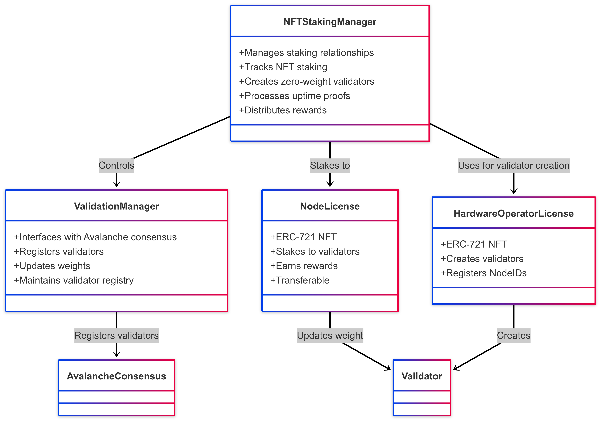
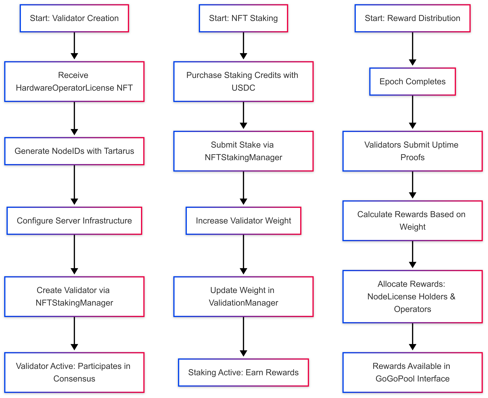

# L1 Staking Architecture

This document outlines the Hypha L1 staking architecture, covering its components, processes, and integration for L1 projects.

## Overview

Hypha's [L1 Marketplace (L1M)](https://l1s.gogopool.com/marketplace) provides a comprehensive infrastructure for launching and supporting Avalanche L1s through a unique staking and validation system. This architecture document details how the platform connects L1 projects, stakers, and hardware providers in a seamless ecosystem.

The architecture includes key components that enable staking, validation, and reward distribution.

### Smart Contract System

The following are definitions and descriptions for each of the essential contracts that power the Hypha staking system, enabling validator creation, stake, and reward distribution in a trustless manner.

<figure><figcaption>
L1 Staking Architecture - Smart Contract System
</figcaption></figure>

#### NFTStakingManager

The `NFTStakingManager` serves as the central orchestration layer for the entire staking ecosystem.

* Manages relationships between hardware operators and node license holders.
* Tracks NFT staking and adjusts validator weights automatically through the `ValidationManager`
* Enables hardware operators to create zero-weight validators using `HardwareOperatorLicense` NFTs, each with a configurable amount of default weight.
* Allows `NodeLicense` holders to delegate NFTs to validators, increasing their consensus weight.
* Processes uptime proofs submitted by validators on an epoch schedule to distribute rewards to both `NodeLicense` holders and hardware operators based on their contributions.

#### ValidationManager

The `ValidationManager` contract serves as the interface between Hypha's staking system and the Avalanche consensus mechanism. The `ValidationManager` is a default Avalanche contract that handles the technical aspects of validator lifecycle management within the network.

* Owned exclusively by the `NFTStakingManager`, to ensure only authorized validators participate in consensus.
* Registers validators and updates their weights in the Avalanche network.
* Maintains a registry of active validators and their respective weights, interfacing directly with the subnet's validation process.

While the `NFTStakingManager` focuses on higher-level staking logic, the `ValidationManager` handles the subnet-specific technical implementation details.

#### NodeLicense (ERC-721 NFT)

The `NodeLicense` is an ERC-721 NFT that represents the fundamental staking unit within the Hypha ecosystem.

* Grants its holder the right to contribute staking weight to any validator in the network.&#x20;
* Holders delegate to validators, adding weight and earning rewards based on validator performance.
* Enables staking without running hardware, lowering participation barriers.
* Can be acquired through primary sales from L1 projects or secondary markets, ensuring liquidity.

> A `NodeLicense` alone does not allow someone to create a zero-weight validator; that capability is dependent on the `HardwareOperatorLicense`.

#### HardwareOperatorLicense (ERC-721 NFT)

The `HardwareOperatorLicense` is a specialized ERC-721 NFT that grants its holder the ability to create and operate validators within the network.

* Represents authorization to provide the physical infrastructure that secures the network.
* Holders register NodeIDs with the `ValidationManager` and create validators with default weight through the `NFTStakingManager`.
* Supports two revenue models:
  1. **On-chain hardware payment tracking:** Operators can record that `NodeLicense` holders have paid for hardware costs directly.
  2. **Staking fee percentages:** If there’s no direct hardware payment, operators can collect a percentage of rewards as staking fees from `NodeLicense` stakings.

The distribution of `HardwareOperatorLicenses` is typically controlled to ensure that only qualified and trusted entities can operate network infrastructure. This curation process helps maintain network reliability and performance standards.

### Process Flow

The following diagram illustrates the three critical operational workflows within the Hypha L1 Staking ecosystem.

<figure><figcaption>
L1 Staking Process Flow
</figcaption></figure>

