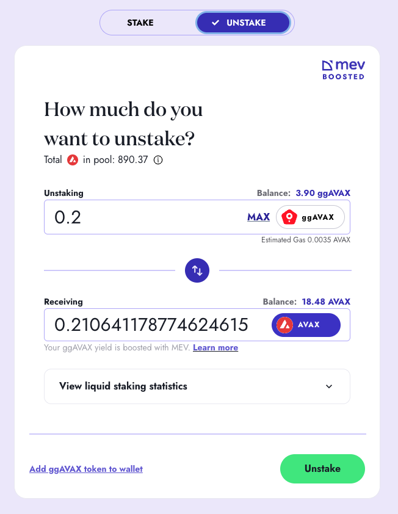

# 📘 Guide: How to Stake - Unstake AVAX

## How to Stake AVAX with GoGoPool

By following these steps, you can efficiently stake your `AVAX` with GoGoPool, leveraging the enhanced yields and security offered by our staking platform.

### Step 1: **Access the GoGoPool**

Visit [GoGoPool](https://app.gogopool.com/) by navigating our website. Connect your wallet using the **Connect** button at the top right corner of the website.

### Step 2: **Navigate to the Liquid Staking Page**

Access the [liquid staking interface](https://app.gogopool.com/liquid-staking/) by clicking the **Liquid Stake** link on the top navigation bar.

<figure><figcaption>
Liquid staking interface
</figcaption></figure>

### Step 3: **Enter Staking Amount**

Decide how much `AVAX` you want to stake. You can input any amount, as there is no minimum staking requirement with GoGoPool. Make sure you leave enough `AVAX` in your wallet for transaction fees.

### Step 4: Confirm Staking AVAX

Review the amount of `ggAVAX` that you will get. Then, click the **Deposit AVAX** button to stake your `AVAX`.

<figure><figcaption>
Click <strong>Deposit AVAX</strong> after reviewing the amount that you will get
</figcaption></figure>

### Step 5: Completion

Once the transaction you approve through the wallet is confirmed in the blockchain, the shown amount of `ggAVAX` will be in your wallet.


If your wallet (i.e., Metamask, Rabby, Core) does not show the balance of `ggAVAX` automatically, you can add `ggAVAX` by its contract address, `0xA25EaF2906FA1a3a13EdAc9B9657108Af7B703e3`


<figure><figcaption>
Displaying ggAVAX in a wallet
</figcaption></figure>


Since `ggAVAX` gains value against `AVAX` over time, you will automatically earn yield by holding `ggAVAX`. But if you wish, you can also use `ggAVAX` in other DeFi applications.


***

## How to Unstake AVAX with GoGoPool

By following these steps, you can efficiently unstake your `AVAX` from GoGoPool, taking advantage of our platform’s liquidity and immediate unstaking option.

### Step 1: **Access the GoGoPool**

Visit [GoGoPool](https://app.gogopool.com/) by navigating our website. Connect your wallet using the **Connect** button at the top right corner of the website.

### Step 2: **Navigate to the Liquid Staking Page**

Access the [liquid staking interface](https://app.gogopool.com/liquid-staking/) by clicking the **Liquid Stake** link on the top navigation bar.

<figure><figcaption>
Liquid staking interface
</figcaption></figure>

### Step 3: **Enter Unstaking Amount**

Decide how much `ggAVAX` you want to redeem. You can input any amount, as there is no minimum staking requirement with GoGoPool. Make sure that there is enough `AVAX` in the liquidity pool.


If there is not enough `AVAX` in the liquidity pool as you want to redeem, you can convert your `ggAVAX` into `AVAX` through DEXs. See the [**How to Swapping `ggAVAX` and `AVAX` Through DEXs**](guide-how-to-stake-unstake-avax.md#how-to-swapping-ggavax-and-avax-through-dexs) section for details.


### Step 4: Confirm Unstaking AVAX

Review the amount of `AVAX` that you will get back. Then, click the **Redeem ggAVAX** button to unstake your `AVAX`.

<figure><figcaption>
Click <strong>Redeem ggAVAX</strong> after reviewing the amount that you will get
</figcaption></figure>

### Step 5: Completion

Once the transaction you approve through the wallet is confirmed in the blockchain, the shown amount of `AVAX` will be transferred to your wallet.

<figure><figcaption>
Displaying the unstaking transaction in a wallet history
</figcaption></figure>

***

## How to Swapping `ggAVAX` and `AVAX` Through DEXs

By following these steps, you can efficiently swap `ggAVAX` and `AVAX` using DEXs, leveraging the liquidity and flexibility offered by decentralized finance platforms.

### Step 1: **Choose a DEX / DEX Aggregator**

Select a decentralized exchange (e.g., [TraderJoe](https://traderjoexyz.com/), [Uniswap](https://app.uniswap.org/swap?chain=avalanche)) or decentralized exchange aggregator (e.g., [ParaSwap](https://app.paraswap.io/), [LlamaSwap](https://swap.defillama.com/?chain=avax\&from=0x0000000000000000000000000000000000000000\&to=0xa25eaf2906fa1a3a13edac9b9657108af7b703e3)).

### Step 2: Connect Your Wallet

Click on the **Connect Wallet** or similar button on the decentralized application you chose, and follow the prompts to connect your wallet (e.g., MetaMask, Rabby, Core). If the decentralized application supports multiple blockchains, ensure the selected blockchain is Avalanche.

<figure><figcaption>
Connect your wallet
</figcaption></figure>

### Step 3: Select the Trading Pair

Select `ggAVAX` and `AVAX` from the list of available tokens to set up your trading pair.


If `ggAVAX` is not shown in the list, add it by the contract address, `0xA25EaF2906FA1a3a13EdAc9B9657108Af7B703e3`


### Step 4: Enter the Swap Amount

Input the amount of token (e.g., `ggAVAX`, `AVAX`) you wish to swap, and the application will automatically show the equivalent amount of the output token you will receive based on current market rates.

### **Step 5: Review and Confirm the Swap**

Review all the details, then click the button to initiate the transaction.

<figure><figcaption>
Initiate the transaction after reviewing all the details
</figcaption></figure>

### **Step 6: Complete the Transaction**

Approve the transaction from your wallet and wait for the blockchain to process it. The swapped token (e.g., `ggAVAX`, `AVAX`) will be in your wallet once the transaction is confirmed.


You may need to approve the `ggAVAX` token for trading if it's your first time swapping it on the DEX.


<figure><figcaption>
A successfully completed swap transaction
</figcaption></figure>


Since `ggAVAX` gains value against `AVAX` over time, you will automatically earn yield by holding `ggAVAX`. But if you wish, you can also use `ggAVAX` in other DeFi applications.


***


Need help? If you encounter any issues or have questions, our support team can assist you. Contact us via our [Discord server](https://discord.com/invite/4fNtjkyuNw) or live chat.

