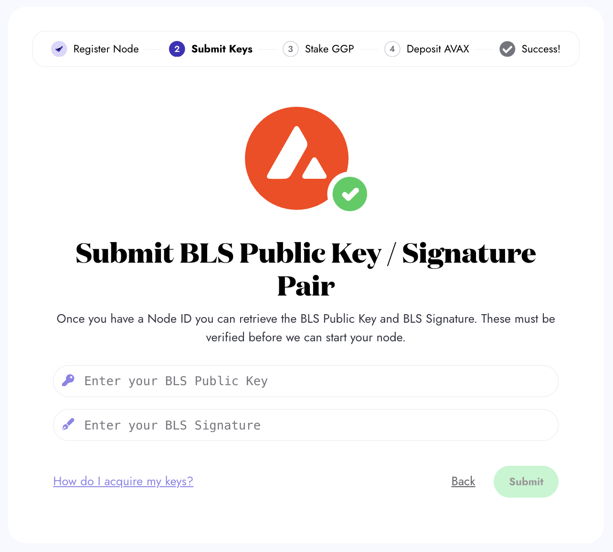
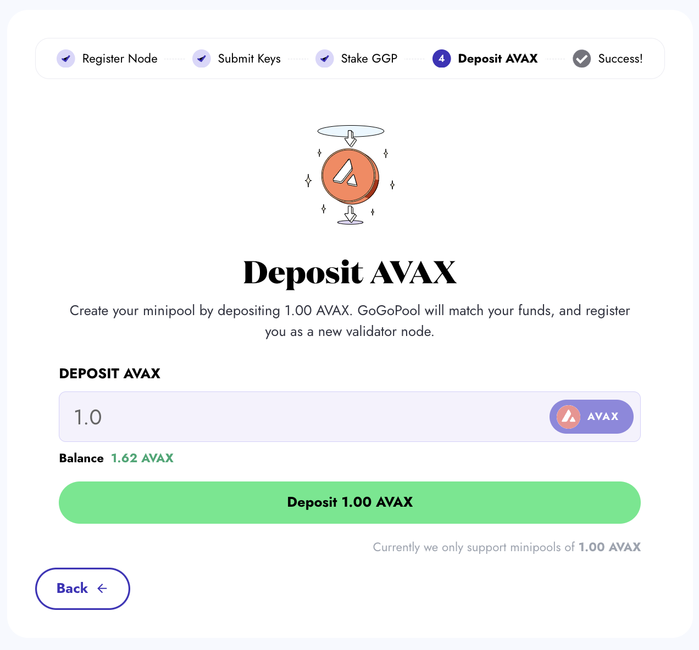
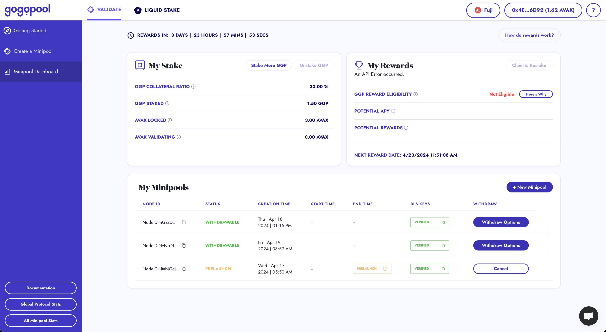

# ⚒️ Guide: How to Launch a Minipool with Manual Setup

The manual setup is ideal for users who prefer a hands-on approach and have the technical know-how to configure and optimize their validator node according to their specific requirements.


The visuals for each setup below show how to create a Minipool on Fuji Testnet. The steps are the same as on Mainnet, but the `AVAX` and `GGP` requirements are different.

Use our [faucet](https://faucet.gogopool.com) to get a test GGP and test GoGoPool on Fuji Testnet.


## Creating Your Node

To use GoGoPool as a Minipool operator, and earn rewards on your staked `GGP`, you have to have an Avalanche node. To create a node, see the [Official Avalanche guides](https://docs.avax.network/nodes). Once you have a Node ID, come back to GoGoPool to register as a validator.

## How to Make a Minipool with Manual Setup

### Step 1: Register a Node ID with GoGoPool

Enter your Node ID and select the duration. A longer duration is advisable since it allows your `AVAX` to compound over successive 15-day cycles, ensuring that your Minipool continues running seamlessly without the need to re-queue for each new cycle.

<figure><figcaption>
Place your Node ID in the input box as shown, then press Next.
</figcaption></figure>

### Step 2: Submit BLS Public Key

Enter your BLS public key and signature for verification. Further information about BLS keys, why they are needed, and how to access yours is [here](avalanche-bls-keys.md).

<figure><figcaption>
Place your BLS Public Key and BLS Signature in the input box as shown, then press Submit.
</figcaption></figure>

### Step 3: Approve and Deposit GGP

Enter the `GGP` amount to deposit for staking. Although a minimum 10% collateralization ratio of `GGP` is enough, staking beyond 10% is advisable against price fluctuations and maximizes rewards.

An approval process is required for the `GGP` amount you want to stake to be transferred to the staking contract.

<figure><figcaption>
Input your GGP amount to stake and click the button. Then, you are prompted to approve the transfer of GGP for staking.
</figcaption></figure>

After the approval, initiate the staking transaction.

<figure><figcaption>
After the approval, click “Deposit GGP” to initiate the staking transaction. Then, you are prompted to confirm the transaction.
</figcaption></figure>

### Step 4: Stake AVAX

Enter the`AVAX` amount to create your minipool. Currently, the amount of `AVAX` that must be deposited by the user to create a minipool on the mainnet is 1000 `AVAX`.

<figure><figcaption>
Input your AVAX amount and click the Deposit button. Then, you are prompted to confirm the transaction.
</figcaption></figure>

### Step 5: Minipool Creation

Once you deposit AVAX, your Minipool is created! If there is no queue and sufficient AVAX is available in the liquid staking pool, your Minipool will be launched immediately.

To view the current AVAX balance in the liquid staking pool and the available minipool amount to launch, please [visit our liquidity dashboard](https://flipsidecrypto.xyz/GoGoPool/ggp-protocol-stats-PitGzK?tabIndex=2).

<figure><figcaption>
Minipool successfully created! Use the hash to view the transaction on a block explorer. Proceed to the dashboard to view your Minipool.
</figcaption></figure>

### Step 6: View Your Minipool on the Dashboard

Head to [the dashboard](https://app.gogopool.com/dashboard/) to view detailed information about your Minipool.

<figure><figcaption>
The dashboard is useful for keeping up to date with your Minipools.
</figcaption></figure>

***


Need help? If you encounter any issues or have questions, our support team can assist you. Contact us via our [Discord server](https://discord.com/invite/4fNtjkyuNw) or live chat.

