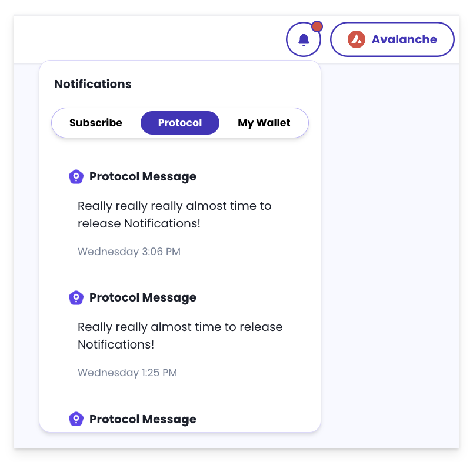
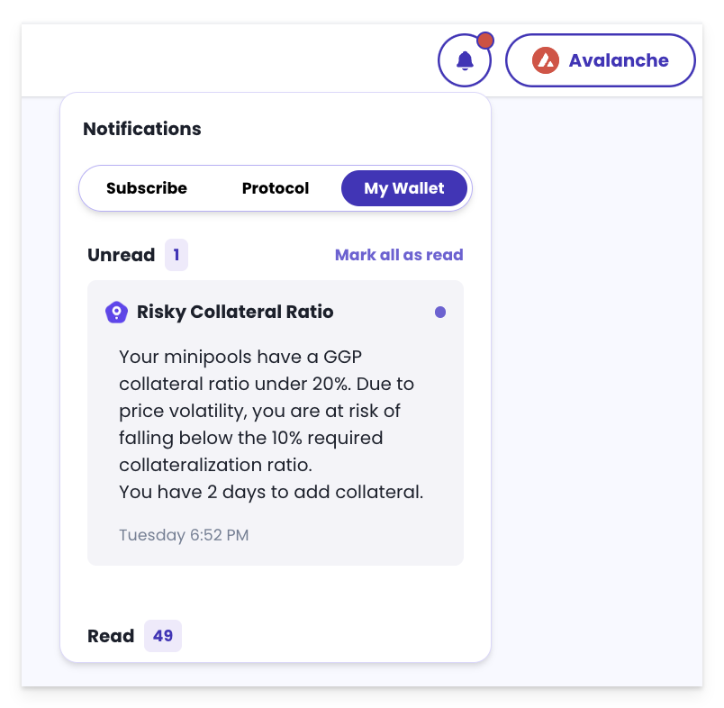
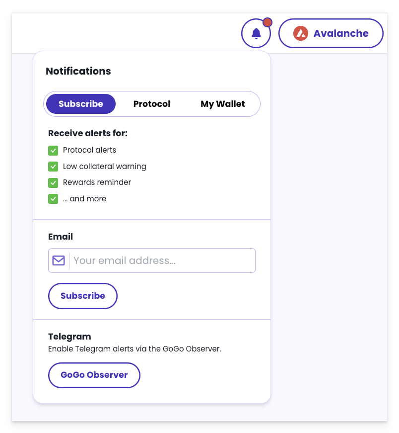
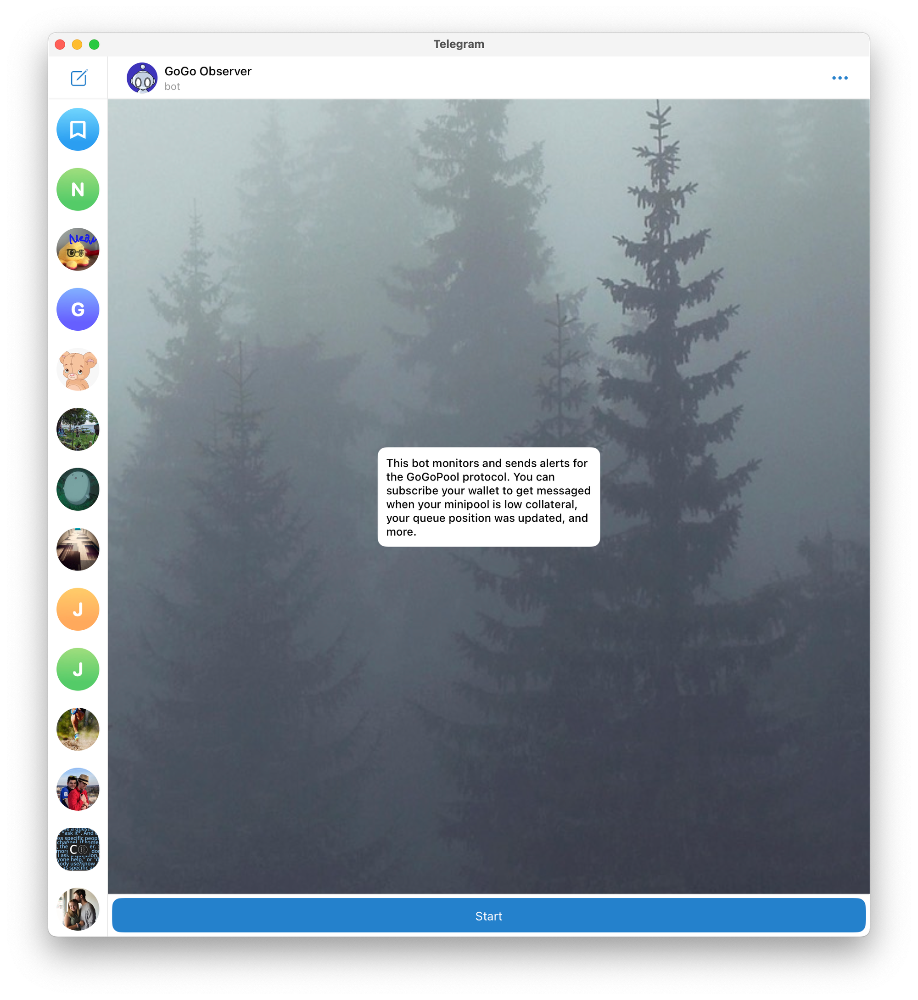
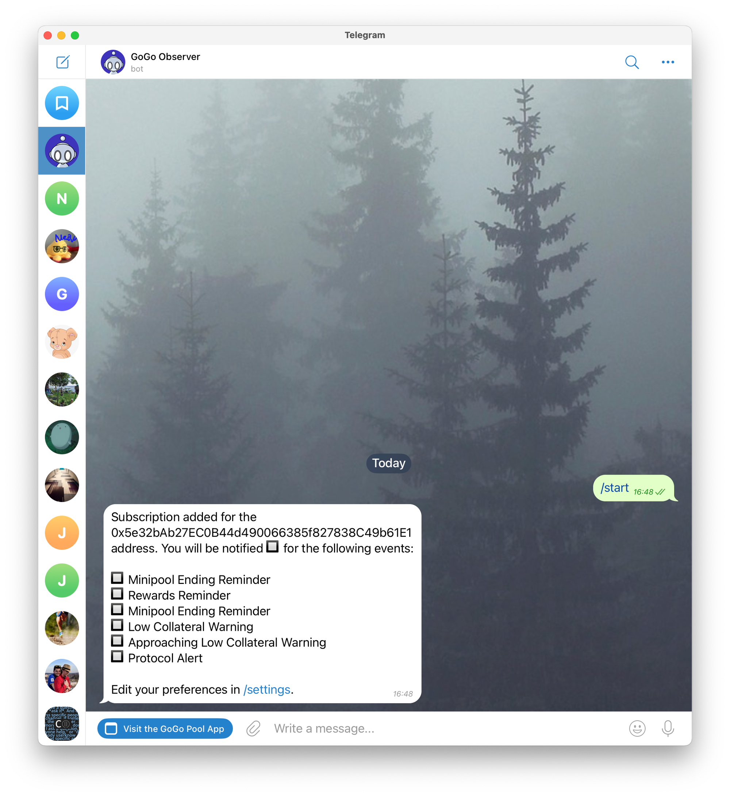

# ⏰ Notifications

GoGoPool's notification system offers timely alerts on account activities such as upcoming rewards, minipool endings, and collateral levels. It sends timely reminders for scheduled events and provides urgent warnings if collateral falls below set thresholds, helping users maintain their investments and avoid potential penalties.

## Types of Notifications

#### **Scheduled Reminders and Alerts:**

* **Minipool Rewards Reminder:** Receive reminders about upcoming `GGP` rewards for active stakers and minipool operators, ensuring you never miss out on your earnings. This reminder is sent daily and does not repeat until the next occurrence.
* **Minipool Ending Reminder:** Get alerts when your minipool is nearing the end of its term. This reminder is sent daily and does not repeat until the next occurrence.

#### **Urgent Notifications:**

* **Node Health Status Warning**: Receive alerts if your validator's health drops below 90%, prompting you to check and maintain performance above the 80% threshold necessary for rewards.
* **Low Collateral Warning:** Get alerts when your collateral drops below 10%, risking your eligibility for `GGP` rewards. Notifications are checked hourly and repeated once a day as long as the issue continues.&#x20;


If your collateral ratio is below 10% once your next Minipool or rewards cycle ends, your active Minipools are at risk of termination, and you may lose eligibility for `GGP` rewards.


* **Approaching Low Collateral Warning:** Receive early warnings when your collateral is below 20%, helping you avoid any possible losses. Notifications are checked hourly and repeated every 5 days if the issue continues.


Increasing your `GGP` stake enhances your rewards and reduces the risk of termination or reward losses due to negative price volatility.


#### **General Protocol Alerts:**

* **General Protocol Alert:** Important updates sent to all subscribers, covering essential protocol developments or urgent news.

## Setting Up Notifications

GoGoPool offers multiple channels to inform you about important updates and events related to your staking activities.

### In-app Notifications

Receive all notifications directly through the in-app notification panel. Protocol-related notifications are displayed under the **Protocol** tab and are accessible without connecting a wallet. When a wallet is connected, custom notifications specific to that wallet are shown under the **My Wallet** tab.

<figure><figcaption>
Protocol-related notifications through the in-app panel
</figcaption></figure>

 

<figure><figcaption>
Wallet-specific custom notifications through the in-app panel
</figcaption></figure>

### Email Notifications

To activate email notifications, connect your wallet in the GoGoPool app and navigate to the notifications setup. Enter your email address to start receiving notifications. Each alert will be directly sent to your inbox, keeping you updated on the specific activities of your connected address and protocol-related updates.

<figure><figcaption>
Email subscription
</figcaption></figure>


**Want to Unsubscribe?**\
\
At the bottom of every notification email, you will find a unique link labeled **Unsubscribe**. Clicking this link will immediately unsubscribe you from all future email notifications for that specific email address.


### Telegram Notifications

To set up Telegram notifications for real-time updates, follow these steps:

1. **Initiate the Setup**: Click the notification button to navigate to the notifications section. Then, click the **GoGoObserver** button in the in-app notification panel to initiate the setup.
2. **Link to Telegram**: Clicking this button will open the bot in Telegram if the app is installed on your device.
3. **Start Conversation**: If you're setting up for the first time, send a start message or use the provided command to wake up the bot.
4. **Subscribe to Updates**:
   * If your wallet is connected when you access the bot, it will automatically suggest updates for that address.
   * If no wallet is connected or you want to add additional addresses, type `/subscribe <wallet_address>` to start receiving notifications for the specified address.

<figure><figcaption>
Starting conversation
</figcaption></figure>

 

<figure><figcaption>
Telegram subscription
</figcaption></figure>

5. **Adjust Notification Settings** (Optional):
   * Type `/settings` to customize your notification preferences.
   * By default, all notification types are enabled. You can turn off certain alerts if they are not needed.
6. **List Tracked Addresses** (Optional): To view all the addresses you are currently tracking for notifications, type `/subscriptions` in the chat with the bot.
7. **Unsubscription** (Optional):
   * Use `/unsubscribe` command to unsubscribe from all future Telegram notifications.
   * To unsubscribe from only one wallet, use `unsubscribe <wallet_address>` command.


**Join Groups or Track Multiple Addresses**\
\
The bot can be added to groups or track multiple addresses. Use the `/subscribe` command followed by the wallet address to track additional addresses.

