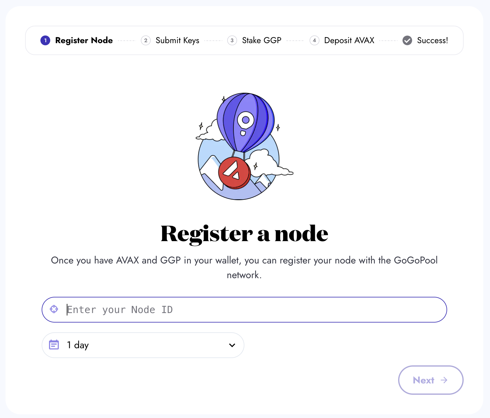
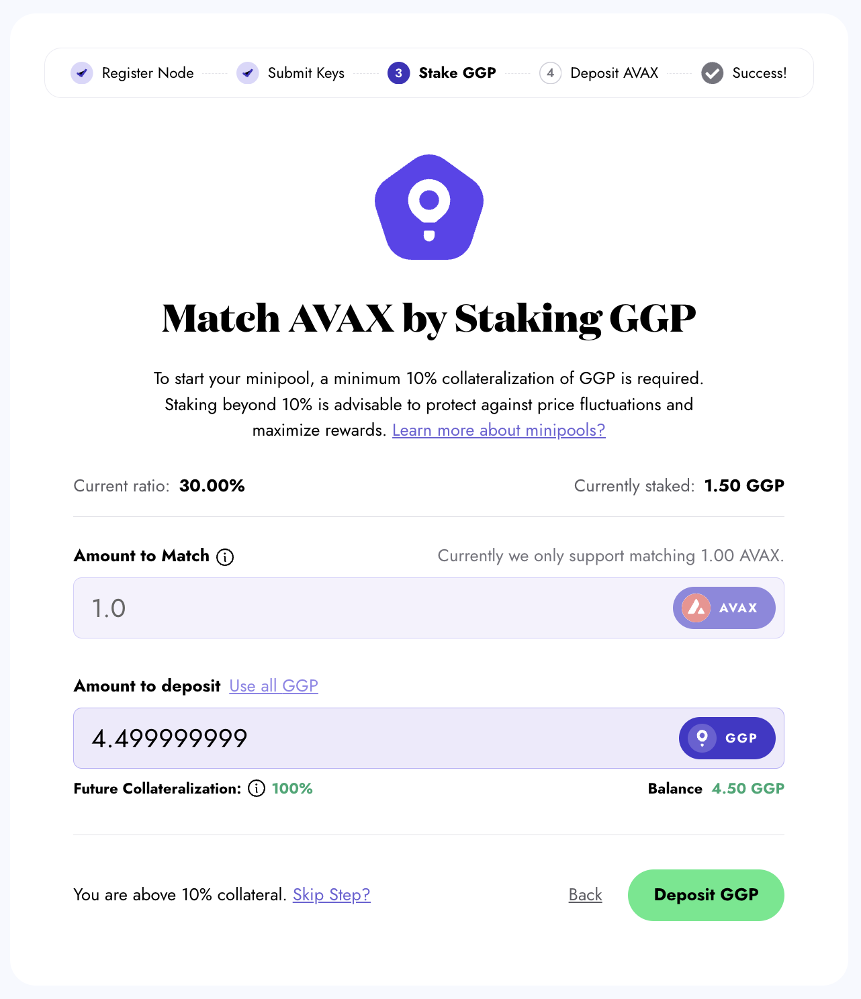

# Manual Setup

To test GoGoPool on Fuji, use our [faucet](https://anr-ggp-faucet.fly.dev/) to get test GGP.


The visuals for each setup below show how to create a Minipool on Fuji. The steps are the same as on Mainnet, but the AVAX and GGP requirements are different.


## Creating a Fuji or Mainnet node

To use GoGoPool as a node operator, and earn rewards on your staked GGP, you have to have an Avalanche node. To create a node, see the [Official Avalanche guides](https://docs.avax.network/nodes). Once you have a NodeId, come back to GoGoPool to register as a validator.

## How to make a Minipool with Manual Setup

### Step 1: Register a NodeId with GoGoPool

<figure><figcaption>
Place your NodeId in the input box as shown, then press next.
</figcaption></figure>

### Step 2: Approve and Deposit GGP

Your wallet provider will prompt you to approve and transfer GGP

<figure><figcaption>
This wallet already has 1 GGP staked, by staking another 0.5 GGP, the collateralization ratio will be 150%. The user is prompted to approve the transfer of GGP.
</figcaption></figure>

<figure><figcaption>
Once the GGP transfer is approved by the user, the user can deposit GGP.
</figcaption></figure>

### Step 3: Stake AVAX

Your wallet provider will prompt you to transfer AVAX

<figure><figcaption>
Deposit AVAX
</figcaption></figure>

### Step 4: Minipool created!

Once you deposit AVAX, your Minipool is created! You can use the hash to see the transaction on your block explorer of choice.

<figure><figcaption>
Minipool successfully created! Use the hash to view the transaction on a block explorer. Proceed to the dashboard to view your Minipool.
</figcaption></figure>

### Step 5: View the new Minipool on your dashboard

<figure><figcaption>
The dashboard is useful for keeping up to date with your Minipools
</figcaption></figure>
