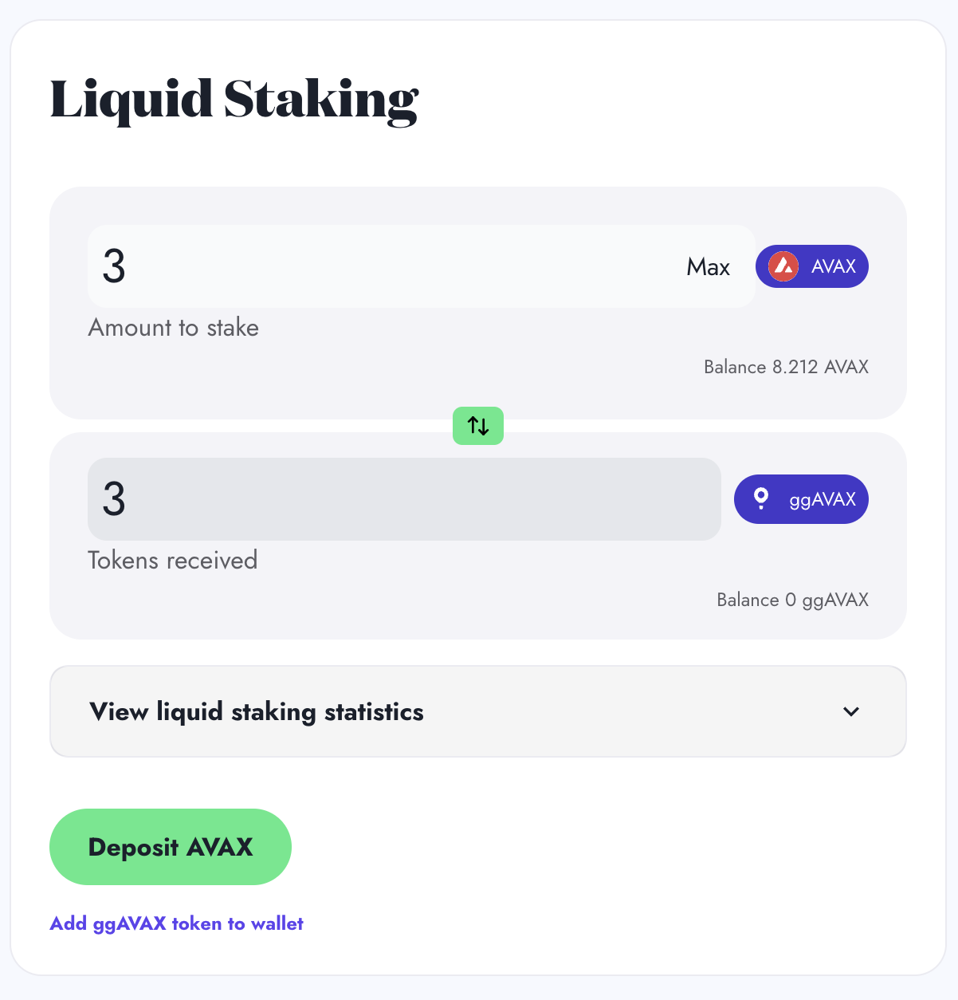
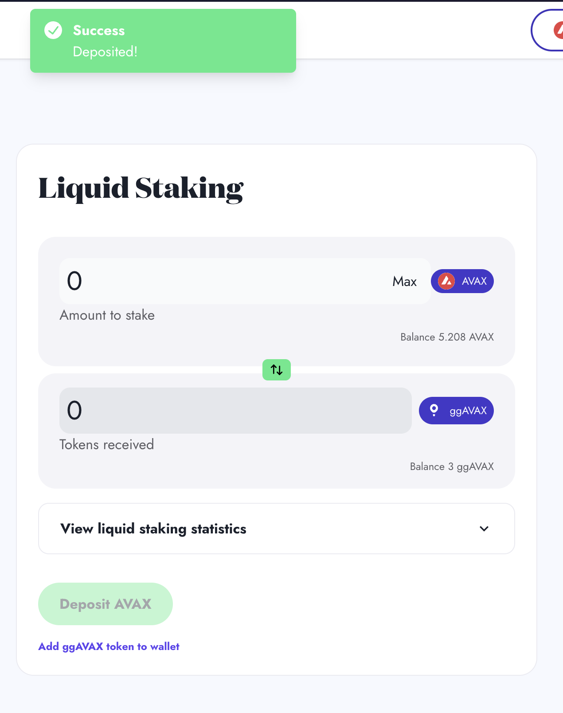
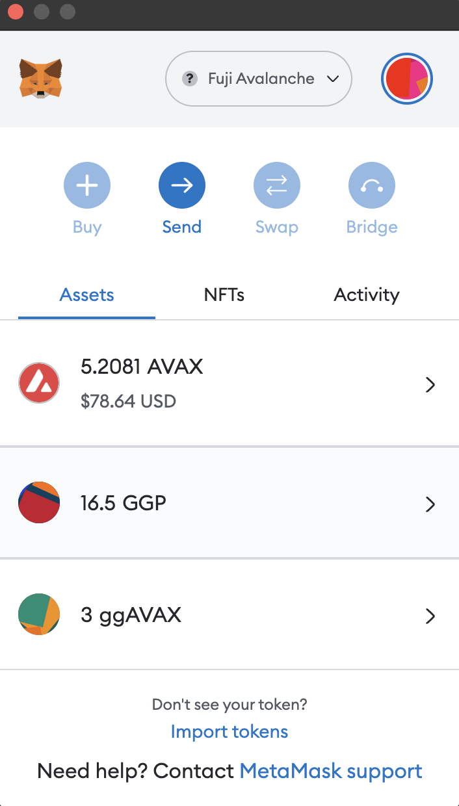

# As a Liquid Staker

## Overview

When you liquid stake with GoGoPool, your $AVAX goes directly towards growing the Avalanche network and getting more subnets and validators launched.\
\
Your AVAX is staked into a deposit pool. These deposit pool funds are then used to match with node operators who want to become a validator for Avalanche's primary network. To learn more about how Avalanche utilizes proof-of-stake validation, check out [Avalanche's official documentation](https://www.avax.network/proof-of-stake-pos).\
\
Every Subnet requires validators to operate, and every Subnet validator must also validate the Avalanche Primary network. Currently, there is no cohesive way for Subnets in need of validators and validators who want to validate Subnets to get in contact. GoGoPool aims to solve this by incentivizing node operators to run through the protocol, in order to create a set of validators that are oriented towards helping Subnets.&#x20;

Learn more about how Liquid Staking on GoGoPool works [here](../design/how-liquid-staking-works/).


The visuals below show how to liquid stake on Fuji. The steps are the same as on Mainnet.&#x20;


To test GoGoPool on Fuji, use our [faucet](https://anr-ggp-faucet.fly.dev/) to get test GGP.

## How Stake with GoGoPool

### Step 1: Deposit AVAX

Your wallet provider will prompt you to transfer AVAX

<figure><figcaption></figcaption></figure>

### Step 2: Receive ggAVAX

Check your wallet to see the ggAVAX.

<figure><figcaption>
A success message will be visible at the top of the screen
</figcaption></figure>

<figure><figcaption>
The ggAVAX should be visible in your wallet. If you do not see it, make sure you have imported ggAVAX.
</figcaption></figure>
