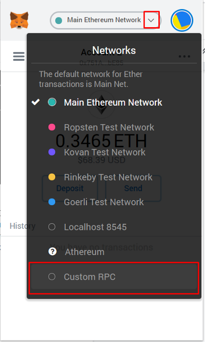

# Wallet Configuration

## Supported Wallets & Browsers

During our initial alpha and beta period, we will only be supporting the [Metamask](https://metamask.io/) browser wallet, and will only be supporting desktop usage via [Chrome](https://www.google.com/chrome/), [Firefox](https://www.mozilla.org/en-US/firefox/new/), and [Brave](https://brave.com/).&#x20;

## Adding Networks To Metamask

Log in to MetaMask -> Click the Network drop-down -> Select Custom RPC

#### **Avalanche Mainnet Settings:**

* **Network Name**: Avalanche Mainnet C-Chain
* **New RPC URL**: [https://api.avax.network/ext/bc/C/rpc](https://api.avax.network/ext/bc/C/rpc)
* **ChainID**: `43114`
* **Symbol**: `AVAX`
* **Explorer**: [https://snowtrace.io/](https://snowtrace.io/)

#### **FUJI Testnet Settings:**

* **Network Name**: Avalanche FUJI C-Chain
* **New RPC URL**: [https://api.avax-test.network/ext/bc/C/rpc](https://api.avax-test.network/ext/bc/C/rpc)
* **ChainID**: `43113`
* **Symbol**: `AVAX`
* **Explorer**: [https://testnet.snowtrace.io/](https://testnet.snowtrace.io/)

#### Multisig Labs Testnet Settings:

* **Network Name:** Multisig Labs Testnet
* **New RPC URL:** [https://anr.fly.dev/ext/bc/C/rpc](https://anr.fly.dev/ext/bc/C/rpc)
* **ChainID:** 43112
* **Symbol:** AVAX
* **Explorer:** N/A
